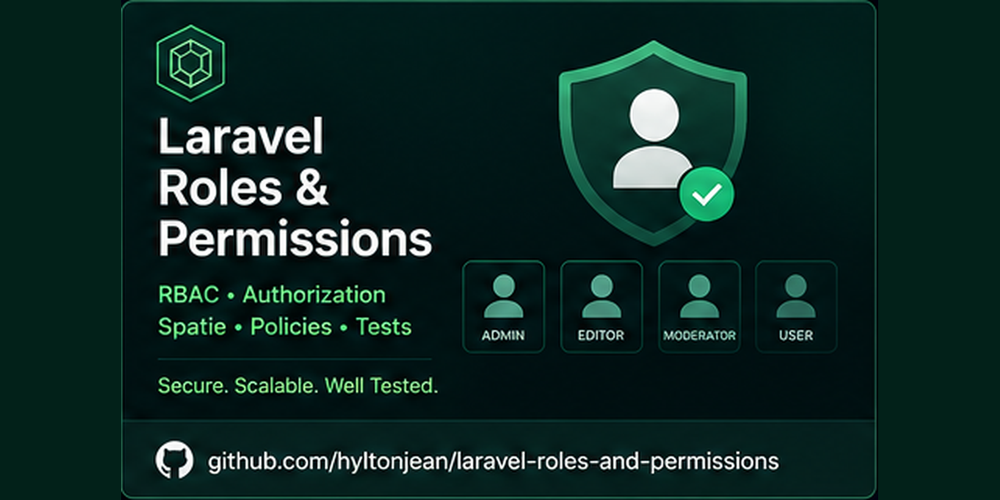

# Laravel Roles & Permissions

A Laravel 10 backend application demonstrating role-based access control (RBAC), user administration, authorization policies, authentication, login-device detection, external service integration, automated testing and Docker-based development.

This repository originated from a technical implementation brief and has been retained as a portfolio example of Laravel backend engineering.

## Engineering highlights

- Laravel 10 / PHP 8.1+
- Authentication and email verification with Laravel Breeze
- Custom role and permission models
- Many-to-many user/role and role/permission relationships
- Policy-based authorization
- Role-aware route middleware
- Administrative user CRUD
- Form Request validation
- Login IP and user-agent tracking
- New-device email notifications
- External IP geolocation service
- Deterministic external-service failure handling
- PHPUnit feature and authentication tests
- SQLite in-memory test database
- GitHub Actions CI
- Vite / Tailwind / Alpine.js frontend tooling
- Docker Compose / Laravel Sail development environment

## Authorization model

The application models three roles:

- **Admin** — administrative dashboard access and user management
- **Content Manager** — manager dashboard access without user administration
- **User** — standard application access

The current permission model includes:

- `view-admin-dashboard`
- `administer-users`

Authorization is enforced through Laravel policies, middleware and role/permission relationships. `UserPolicy` centralizes authorization decisions for administrative operations, while protected route groups enforce access to the Admin and Manager areas.

## User management

Administrators can:

- View and search users
- Create users
- Assign one or more roles
- View user details
- Update user information and role assignments
- Delete users

Input validation is handled with Laravel Form Requests, while role assignments are persisted through the user/role pivot relationship.

## Login-device detection

Successful authentication records the user's IP address, user agent, login timestamp and resolved location.

If the current IP address or user agent differs from the stored device information, the application treats the authentication as a new-device login. It then resolves the IP address, updates the stored login/device information and sends a new-device login email notification.

### Geolocation service

External IP lookup is isolated behind `IpGeolocationService`.

The service:

- Uses an HTTPS provider by default (`https://ipwho.is`)
- Uses a configurable provider base URL
- Applies a 3-second request timeout
- Uses limited retry handling
- Handles HTTP and transport failures
- Returns no fabricated location data

If geolocation cannot be resolved, the application stores the deterministic value `Unknown`.

## Testing

The project contains automated tests covering authentication, authorization and user-management behavior, including:

- Login and logout
- Successful and invalid authentication
- New-device login tracking
- Successful geolocation lookup
- Geolocation failure handling
- New-device email notification behavior
- Email verification
- Password confirmation and reset
- Password updates
- Registration
- Unauthenticated access restrictions
- Admin and Content Manager permissions
- Standard-user restrictions
- Admin user creation, update and deletion
- Admin and manager dashboard access
- Invalid create/update validation

The current suite contains **35 tests / 86 assertions**.

Run it with:

```bash
php artisan test
```

PHPUnit uses an in-memory SQLite database for automated tests, keeping the suite isolated from the application's development database.

## Continuous integration

GitHub Actions runs application verification on pushes and pull requests. The workflow:

1. Checks out the repository
2. Configures PHP
3. Installs locked Composer dependencies
4. Prepares the Laravel application
5. Configures Node.js
6. Installs frontend dependencies
7. Builds production frontend assets
8. Runs the Laravel test suite

The current `master` branch passes this CI pipeline successfully.

## Technology stack

### Backend

- PHP 8.1+
- Laravel 10
- Laravel Breeze
- Laravel Sanctum
- Eloquent ORM
- PHPUnit 10

### Frontend

- Blade
- Tailwind CSS
- Alpine.js
- Axios
- Vite 5

### Development infrastructure

The Docker Compose environment provides:

- Laravel / PHP application container
- MySQL 8
- Redis
- Meilisearch
- MailHog
- Selenium / Chrome
- phpMyAdmin

Redis and Meilisearch are available in the development environment, but this project does not claim application-level caching or search functionality that is not implemented in the source code.

## Local setup

### Requirements

For a direct installation:

- PHP 8.1+
- Composer
- Node.js / npm
- MySQL

Or:

- Docker
- Docker Compose

### Installation

```bash
git clone https://github.com/hyltonwalters/laravel-roles-and-permissions.git
cd laravel-roles-and-permissions
composer install
npm install
cp .env.example .env
php artisan key:generate
```

Configure the application database and mail settings in `.env`, then run:

```bash
php artisan migrate --seed
npm run build
php artisan serve
```

### Run tests

```bash
php artisan test
```

The automated test environment uses SQLite in memory and does not require the development MySQL database.

## Docker environment

After dependencies are installed and `.env` has been configured:

```bash
docker compose up -d --build
```

Run migrations and seeders through your preferred Docker Compose or Laravel Sail workflow.

The Compose configuration represents the project's development environment. The current GitHub Actions workflow verifies dependency installation, frontend compilation and the PHP test suite; it does not currently perform a full Docker Compose integration test.

## Project structure

Important backend areas include:

- `app/Models/User.php` — user, role and permission relationships
- `app/Models/Role.php` — role model
- `app/Models/Permission.php` — permission model
- `app/Models/UserLocation.php` — login/device information
- `app/Policies/UserPolicy.php` — authorization rules
- `app/Http/Middleware/` — role-aware access control
- `app/Http/Controllers/Admin/UserController.php` — administrative user management
- `app/Http/Controllers/Manager/UserController.php` — manager dashboard
- `app/Http/Controllers/Auth/AuthenticatedSessionController.php` — authentication and device tracking
- `app/Services/IpGeolocationService.php` — external geolocation integration
- `app/Http/Requests/Auth/` — user-management validation
- `database/seeders/` — roles, permissions and development data
- `tests/Feature/` — application feature tests
- `.github/workflows/ci.yml` — continuous integration
- `docker-compose.yml` — development services

## Engineering decisions

Several improvements were made while reviewing the project as a portfolio example:

- Corrected Manager routing to use the intended Manager controller
- Corrected validation tests to reflect Laravel web-form behavior
- Changed PHPUnit to use an isolated in-memory SQLite database
- Extracted IP geolocation into a dedicated service
- Replaced non-deterministic fake-location fallback with `Unknown`
- Added explicit external-service timeout and retry behavior
- Added test coverage for device-login tracking and email notifications
- Removed a duplicate unused login-notification class
- Refreshed direct frontend dependencies while avoiding an unnecessary major-framework migration
- Added GitHub Actions build and test verification

## Production considerations

This project is intended as a portfolio and engineering demonstration rather than a production SaaS application. Further production work could include broader observability, queued notification delivery, more extensive external-service resilience, rate limiting, full Docker integration testing, and a deliberate framework/dependency upgrade.

Those concerns are intentionally left for newer production-oriented projects rather than continually expanding this historical repository.

## Project context

This project was originally developed from an implementation brief supplied by **PlusNarrative**. The brief required a Laravel user administration application with roles, permissions, protected routes and new-device login notification behavior.

The implementation and subsequent engineering hardening in this repository represent Hylton Walters' project work based on those requirements.

## Current status

**Portfolio-ready / maintenance mode.**

The current branch has been reviewed and hardened, the frontend builds successfully, and the automated Laravel test suite passes both locally and in GitHub Actions.

The project is retained as evidence of Laravel backend engineering rather than as an actively developed product.

## License

This project is licensed under the [MIT License](LICENSE).
